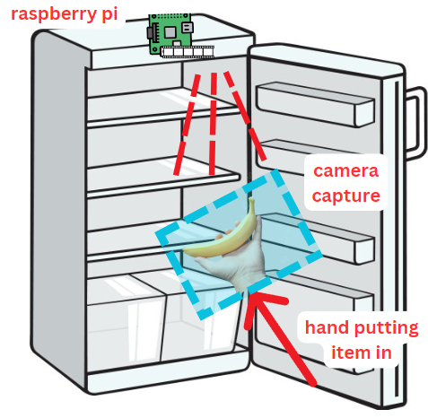

# CulinaryCompanion
Culinary Companion is a smart fridge assistant that provides real-time inventory tracking and tailored recipe recommendations for more efficient and budget-friendly meal preparation than conventional refrigerators in kitchens.

## Motivation
Meal planning and food wastage is a frequent challenge within home kitchens. We aim to assist people in cooking with what they have. 

## Features
We propose a plug-and-play smart fridge assistant with the following features:
- Real-time inventory tracking
- Tailored recipe recommendations 

Our fridge assistant integrates with a Flask application, allowing the user to browse their up-to-date inventory and explore relevant recipes suggestions.


## Repository Contents

The CulinaryCompanion repository contains the following files and folders:

- **Client**: This folder contains the client-side Python script (`client.py`) that runs on the Raspberry Pi device mounted in the fridge.
- **Server**: This folder contains the server-side Python scripts (`server.py` and `app.py`) for real-time inventory tracking and recipe recommendation using Flask.
- **Models**: This folder contains pre-trained models, such as the MobileNetv2 model for food classification.
- **concept_figure.png**: This image file illustrates the conceptual setup of the Raspberry Pi device mounted on the fridge.

## Installation
Set up your Raspberry Pi with the SenseHat and PiCamera sensor. Mount the device on the top-center of your fridge interior. Position the camera to face downwards to best capture insert/removal transitions as shown in the figure below:


## Usage
1. Clone the CulinaryCompanion repository onto your local machine.
2. Download the 'RAW_recipes.CSV' dataset from Food.com linked below and add it to a new 'Datasets' folder at the same level as the 'Server' folder.
3. Copy the *client.py* file under the 'Client' folder onto your Raspberry Pi device. Change the ip_addr variable in this file to match the server's IP.
4. Run *server.py* under the 'Server' folder. Make sure to modify any filepaths to match your local directory structure.
5. From the server side, run ```python -m flask run``` to start the Flask application. Open up the localhost in your browser.
6. Run *client.py* from your Pi device. 
7. Once your Pi is mounted in your fridge, press your joystick "up" or "down" as you insert/remove items to update your inventory database.
8. Explore relevant recipe suggestions in our Flask app!


## Datasets
We utilize two public datasets and one manually crafted dataset during development:
1. [Fruits and Vegetables Image Recognition Dataset](https://www.kaggle.com/datasets/kritikseth/fruit-and-vegetable-image-recognition): This dataset consists of 3600+ fruit and vegetable images across 36 classes intended for object recognition tasks.
2. [Food.com Recipes and Interactions](https://www.kaggle.com/datasets/shuyangli94/food-com-recipes-and-user-interactions): This dataset consists of 180K+ recipes and 700K+ recipe reviews covering 18 years of user interactions and uploads on Food.com (formerly GeniusKitchen). 
3. [Manually Crafted Fruits and Vegetables Dataset](https://drive.google.com/drive/folders/11FbiR0B01JBCBxTz1CC6X99X1j-yoTcy?usp=sharing): Our manually collected dataset of 6 different fruits and vegetable classes (apples, broccoli, carrots, garlic, onion, and ginger). This was used to augmented the Benchmark Fruits and Vegetables Dataset (1) and fine-tune the MobileNetv2 food classifier. 


## Approach
The Culinary Companion leverages AI predictions and IoT based captures:

1. Single Raspberry Pi camera records food item insert/removal transitions
2. Video analysis using a fine-tuned MobileNetv2 model for food type and quantity updates 
3. Ingredient matching for recipe generation based on fridge inventory database

## Demo
Watch a [demo](https://drive.google.com/file/d/1OSgC6K3e8DiX9jD42_IqM3aHRdur-0Us/view?usp=sharing) of the Culinary Companion in action!
